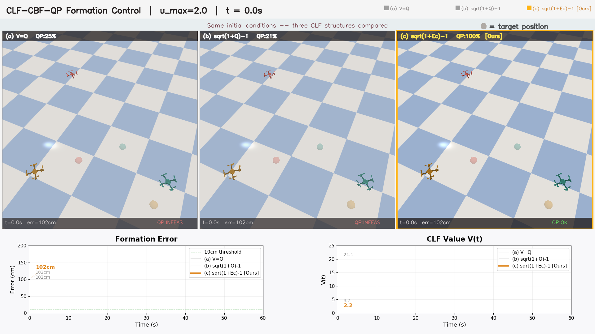
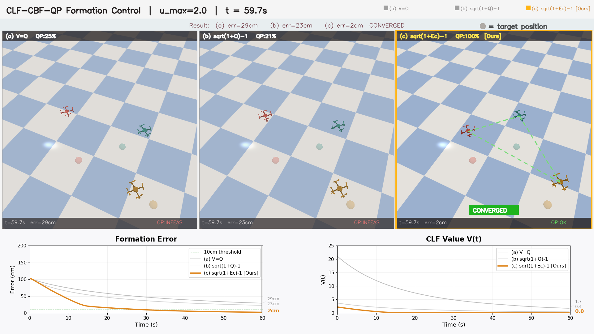

# CA-CEGIS

### Automated Synthesis of Control-Aware Lyapunov Functions for Nonlinear Systems via LLM-Guided Iterative Verification

<p align="center">
  
  
  
</p>

---

## Overview

We present a framework for automatically synthesizing Lyapunov functions that are formally verified and suitable for deployment on real robotic systems with limited actuation.

> 📄 Paper is currently under review. Full details will be available upon publication.

---

## Results

### Reliability (10 independent trials per system)

| System | Dim | Success Rate |
|:-------|:---:|:------------:|
| Van der Pol | 2D | 9/10 |
| Trigonometric | 3D | 10/10 |
| Lossy Power Grid | 4D | 9/10 |
| Lossless Power Grid | 6D | 7/10 |
| Quadrotor | 6D | 10/10 |
| **Aggregate** | **2–6D** | **90% (45/50)** |

### Comparison with RL-based Synthesis (4D Power System)

| Metric | Prior Art | Ours |
|:-------|:---------:|:----:|
| Region of Attraction | Baseline | **2.67× larger** |
| Structural Variety | 1 family | **5 families** |
| Discovery Speed | ~3600s | **90–600s** |

---

## 12D Quadrotor Formation Control

Validated in high-fidelity physics simulation ([gym-pybullet-drones](https://github.com/utiasDSL/gym-pybullet-drones)) with collision and obstacle avoidance.

<p align="center">
  
  <br/>
  <sub>Initial configuration — 4 quadrotors with obstacles</sub>
</p>

<p align="center">
  
  <br/>
  <sub>Converged formation (2 cm error)</sub>
</p>

---

## Code & Data

🔒 Code will be released upon paper acceptance.

---

## Citation

```bibtex
@inproceedings{zhu2026cacegis,
  title     = {Automated Synthesis of Control-Aware Lyapunov Functions
               for Nonlinear Systems via LLM-Guided Iterative Verification},
  author    = {Anonymous},
  booktitle = {IEEE/RSJ International Conference on Intelligent Robots
               and Systems (IROS)},
  year      = {2026},
  note      = {Under Review}
}
```

## Contact

For questions, please open an [issue](../../issues).
